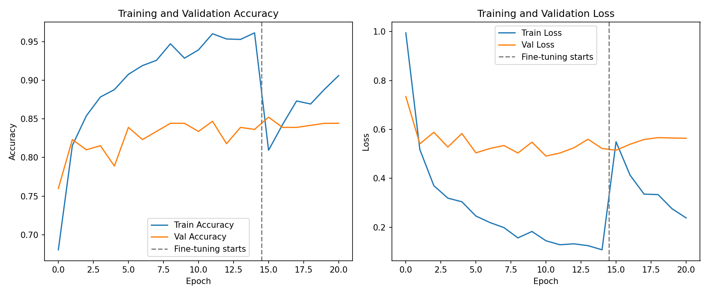
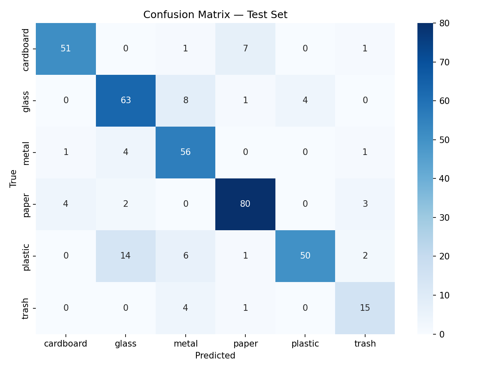

<div align="center">

# ♻️ Garbage Image Classification

**A deep learning system that identifies waste material from a photo and tells you how to recycle it.**

[](https://www.python.org/)
[](https://www.tensorflow.org/)
[](https://garbage-image-classification.streamlit.app/)
[](https://www.gradio.app/)
[](LICENSE)
[](https://colab.research.google.com/github/shahndaa/Garbage-Image-Classification/blob/main/notebooks/training_demo.ipynb)

### 🔗 [**Try the live demo →**](https://garbage-image-classification.streamlit.app/)



</div>

---

## Table of Contents

- [Overview](#overview)
- [Results](#results)
- [How It Works](#how-it-works)
- [Engineering Notes — bugs fixed from the first version](#engineering-notes--bugs-fixed-from-the-first-version)
- [Project Structure](#project-structure)
- [Dataset](#dataset)
- [Getting Started](#getting-started)
- [Usage](#usage)
- [Try the Live Demo](#try-the-live-demo)
- [Model Details](#model-details)
- [Roadmap](#roadmap)
- [Tech Stack](#tech-stack)
- [Credits](#credits)
- [License](#license)

---

## Overview

Waste sorting mistakes are one of the most common (and costly) failures in recycling
programs — a single contaminated item can get an entire batch rejected. This project
tackles a small slice of that problem: given a photo of an item, classify it into one
of **6 material categories** and tell the user whether it belongs in recycling or general
waste, along with a one-line disposal tip.

The model is built with **transfer learning on MobileNetV2**, a lightweight convolutional
network pretrained on ImageNet, fine-tuned on the [TrashNet](https://github.com/garythung/trashnet)
dataset. MobileNetV2 was chosen specifically because it's small and fast enough to eventually
run on a phone or a Raspberry Pi at a recycling station — not just in a notebook.

**Categories:** `cardboard` · `glass` · `metal` · `paper` · `plastic` · `trash`

---

## Results

Evaluated on a **held-out test set** (15% of the data — images the model never saw during
training, validation, or early-stopping decisions):

<div align="center">

| Metric | Score |
|:---|:---:|
| **Test Accuracy** | **82.9%** |
| **Macro F1-score** | **81.4%** |
| **Weighted F1-score** | **82.9%** |

</div>

<details>
<summary><b>Per-class breakdown (click to expand)</b></summary>
<br>

| Class | Precision | Recall | F1-score | Support |
|:---|:---:|:---:|:---:|:---:|
| cardboard | 0.91 | 0.85 | 0.88 | 60 |
| glass | 0.76 | 0.83 | 0.79 | 76 |
| metal | 0.75 | 0.90 | 0.82 | 62 |
| paper | 0.89 | 0.90 | 0.89 | 89 |
| plastic | 0.93 | 0.68 | 0.79 | 73 |
| trash | 0.68 | 0.75 | 0.71 | 20 |

*Trained on a single CPU core in ~35 minutes (15 head-training epochs + 8 fine-tuning epochs).
A GPU run on Colab with the defaults in `src/config.py` (20 + 15 epochs) should push this a bit
higher. `trash` has the weakest F1 — unsurprising, since it's also the smallest class (137 images
before splitting) and visually the most varied category.*

</details>

<div align="center">

</div>

Most of the confusion happens between **glass ↔ metal** and **glass ↔ plastic** — which makes
sense, since bottles and containers made of different materials can look visually similar in a
low-resolution photo.

---

## How It Works

```
Input photo (any size)
        │
        ▼
 Resize to 224×224, apply MobileNetV2 preprocessing
        │
        ▼
 MobileNetV2 backbone (ImageNet-pretrained, feature extractor)
        │
        ▼
 Dense(256) → BatchNorm → Dropout(0.4) → Dense(6, softmax)
        │
        ▼
 Predicted material + confidence + recyclable? + disposal tip
```

Training happens in **two stages**, which is standard practice for transfer learning and is
noticeably better than only training a head:

1. **Stage 1 — Head warm-up.** The MobileNetV2 backbone is frozen (its ImageNet weights are
   left untouched) and only the new `Dense` classification head is trained. This adapts the
   randomly-initialized head quickly without wrecking the pretrained features.
2. **Stage 2 — Fine-tuning.** The top layers of MobileNetV2 are unfrozen and the whole network
   is trained further at a much lower learning rate (`1e-5`), letting the backbone adjust its
   higher-level features specifically to garbage images instead of generic ImageNet objects.

Class weights are computed automatically from the training split to compensate for `trash` being
under-represented, and data augmentation (random flips, brightness/contrast jitter) is applied
only to the training set to reduce overfitting.

---

## Engineering Notes — bugs fixed from the first version

This repository replaces an earlier version of the project that looked reasonable on the surface
but had several bugs that quietly produced misleading results. Documenting them here because
they're common mistakes worth knowing about, not just "code cleanup":

| # | Problem in the old version | Fix in this version |
|---|---|---|
| 1 | Images were rescaled to `[0, 1]` during training (`rescale=1./255`) but preprocessed to `[-1, 1]` at prediction time (`mobilenet_v2.preprocess_input`) — two different input distributions. | A single preprocessing function is used everywhere: training, validation, testing, and inference. |
| 2 | Labels were binarized (`recyclable` vs `trash`) for training, but the output layer had 6 units and was used to predict all 6 material types — the model never actually learned to tell materials apart. | Labels and the output layer are consistent 6-class classification throughout. |
| 3 | Only a train/validation split existed; the validation accuracy was reported as if it were a final score, even though it had already influenced early-stopping decisions. | A proper **train/val/test** split (70/15/15, stratified). The test set is touched exactly once, at the end. |
| 4 | Class weights were hard-coded numbers left over from a previous run of the notebook. | Class weights are computed from the actual training split every time. |
| 5 | The dataset folder structure assumed by the code (`recyclable/`, `non_recyclable/` sub-folders) didn't match the actual TrashNet layout (flat `cardboard/`, `glass/`, etc. folders). | `src/data.py` reads the real flat structure directly. |
| 6 | A hard-coded Windows path (`E:/Codes/...`) meant the notebook only ran on one machine. | All paths are relative/configurable via `src/config.py` and an optional `GARBAGE_DATA_DIR` env var. |

---

## Project Structure

```
Garbage-Image-Classification/
├── src/
│   ├── config.py         # paths, hyperparameters, class names, disposal tips
│   ├── data.py            # stratified train/val/test split + tf.data pipelines
│   ├── model.py           # MobileNetV2 backbone + classification head
│   ├── train.py           # two-stage training loop, evaluation, plots
│   └── predict.py         # inference logic (CLI + importable)
├── app/
│   └── app.py              # Gradio demo (local / Docker)
├── streamlit_demo/
│   ├── app.py               # Streamlit demo — deployed live at the link above
│   └── requirements.txt     # lightweight deps for this demo only
├── notebooks/
│   └── training_demo.ipynb # Colab-friendly, step-by-step walkthrough
├── assets/                  # training curves & confusion matrix (generated by train.py)
├── models/
│   └── garbage_classifier.keras   # trained model, included so the demos work out of the box
├── data/                     # dataset goes here locally (gitignored — see below)
├── Dockerfile                # for Docker-based hosting (e.g. Render)
├── requirements.txt           # full deps, for local training
├── requirements-docker.txt    # lightweight deps for the Dockerfile
└── README.md
```

---

## Dataset

This project uses **TrashNet** ([Thung & Yang, 2016](https://github.com/garythung/trashnet)):
2,527 photos of household waste across 6 classes, taken against a plain background.

| Class | # Images |
|:---|:---:|
| cardboard | 403 |
| glass | 501 |
| metal | 410 |
| paper | 594 |
| plastic | 482 |
| trash | 137 |
| **Total** | **2,527** |

The dataset is not stored in this repo (to keep it lightweight and avoid redistributing
someone else's data). Download it with:

```bash
git clone --depth 1 https://github.com/garythung/trashnet.git /tmp/trashnet
mkdir -p data
unzip /tmp/trashnet/data/dataset-resized.zip -d data/
```

You should end up with `data/dataset-resized/{cardboard,glass,metal,paper,plastic,trash}/`.

---

## Getting Started

### Option A — Google Colab (recommended, free GPU)

Click the **"Open in Colab"** badge at the top of this README, or open
[`notebooks/training_demo.ipynb`](notebooks/training_demo.ipynb) manually
(Runtime → Change runtime type → GPU), and run the cells top to bottom. It clones this repo,
installs dependencies, downloads the dataset, trains the model, and displays the results —
no local setup required.

### Option B — Run locally

```bash
git clone https://github.com/shahndaa/Garbage-Image-Classification.git
cd Garbage-Image-Classification
pip install -r requirements.txt

# download the dataset (see above), then:
python -m src.train                    # full training: head warm-up + fine-tuning
python -m src.train --skip-fine-tune    # faster, head-only (good on CPU)
```

---

## Usage

**Classify a single image from the command line:**
```bash
python -m src.predict path/to/photo.jpg
```
```
Material   : PLASTIC
Confidence : 97.5%
Recyclable : Yes
Tip        : Rinse and check the resin code (1-7) printed on the item.
```

**Use it in your own Python code:**
```python
from PIL import Image
from src import predict

model = predict.load_trained_model()
result = predict.predict(model, Image.open("photo.jpg"))
print(result["material"], result["confidence"], result["is_recyclable"])
```

---

## Try the Live Demo

**🔗 [garbage-image-classification.streamlit.app](https://garbage-image-classification.streamlit.app/)**

Upload a photo and get the predicted material, a confidence breakdown across all 6 classes,
whether it's recyclable, and a disposal tip — no installation required.

<details>
<summary>Run it locally instead</summary>

```bash
pip install -r streamlit_demo/requirements.txt
streamlit run streamlit_demo/app.py
```

A Gradio version is also available in `app/app.py`:
```bash
python app/app.py
```

</details>

---

## Model Details

| | |
|---|---|
| **Backbone** | MobileNetV2 (`alpha=1.0`), ImageNet-pretrained, `include_top=False`, global average pooling |
| **Head** | `Dense(256, relu) → BatchNorm → Dropout(0.4) → Dense(6, softmax)` |
| **Input size** | 224 × 224 × 3 |
| **Loss** | Sparse categorical cross-entropy |
| **Optimizer** | Adam (`1e-3` for head training, `1e-5` for fine-tuning) |
| **Regularization** | Dropout, batch norm, class weighting, data augmentation, early stopping |
| **Fine-tuning** | Top layers of MobileNetV2 unfrozen from layer index 100 onward |
| **Callbacks** | `EarlyStopping` (patience=5, restores best weights), `ReduceLROnPlateau` |

All hyperparameters live in [`src/config.py`](src/config.py) and can be overridden via CLI flags
on `train.py` (`--head-epochs`, `--fine-tune-epochs`, `--skip-fine-tune`).

---

## Roadmap

- [x] Deploy a live demo ([Streamlit Community Cloud](https://garbage-image-classification.streamlit.app/))
- [ ] Add Grad-CAM visualizations to show which pixels drove each prediction
- [ ] Expand the dataset with more `trash`-category images (currently the smallest class)
- [ ] Export to TensorFlow Lite for on-device / Raspberry Pi inference
- [ ] Add a simple REST API (FastAPI) around `src/predict.py`

---

## Tech Stack

Python · TensorFlow / Keras · MobileNetV2 · scikit-learn · NumPy · Matplotlib · Seaborn · Gradio

---

## Credits

Dataset: [TrashNet](https://github.com/garythung/trashnet) by Gary Thung and Mindy Yang (Stanford, 2016).

---

## License

This project is licensed under the [MIT License](LICENSE).
